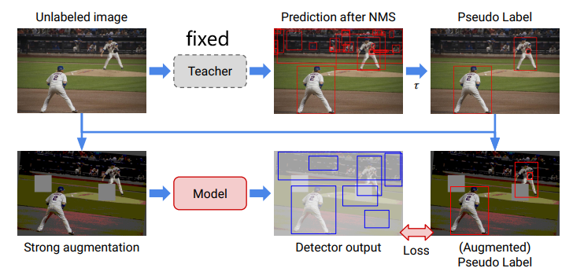
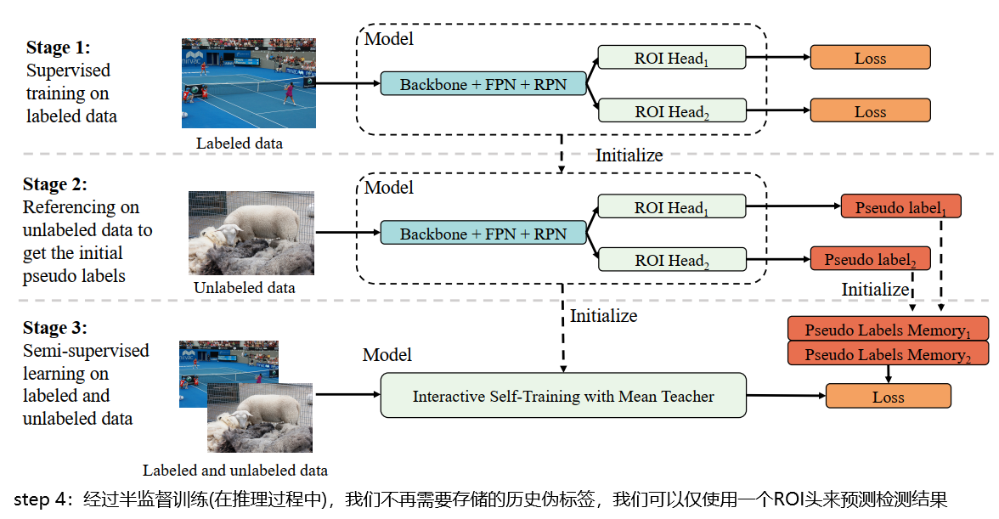
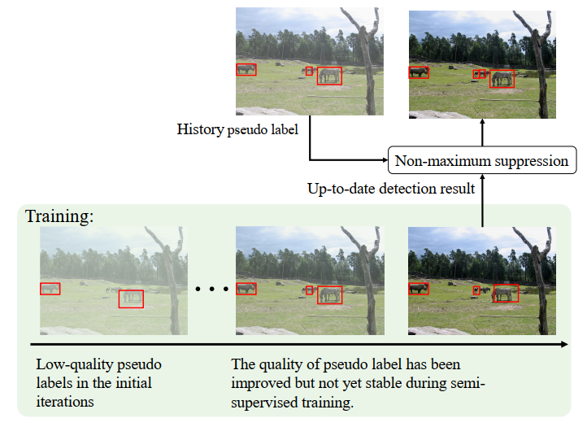
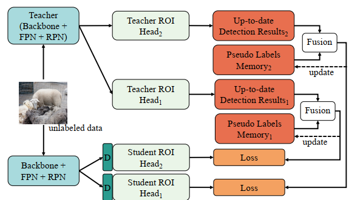
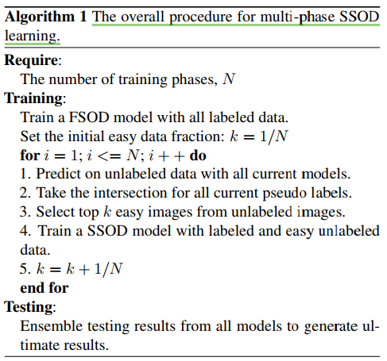
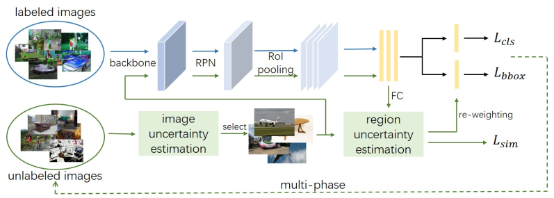
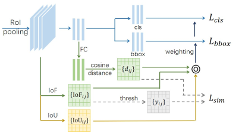
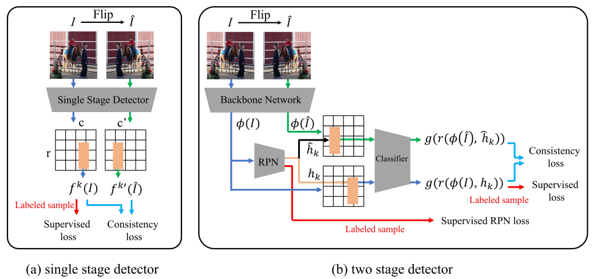

#### A Simple Semi-Supervised Learning Framework for Object Detection（2020，arxiv）
+ Consistency-based SelfTraining
  + 两个关键点：
  + 第一，生成伪标签，并且给定数据增强后的数据后能预测这些伪标签
  + 第二，数据增强
+ 如何利用伪标签是至关重要的
  + noisy-student：一个迭代的教师-学生框架，使用教师模型重复标注作业的过程，然后训练一个更大的学生模型。
  + fixmatch：当模型对弱增广数据的置信度较高时，将强增广未标记数据的预测与弱增广对应数据的伪标签进行匹配。
+ 给出了一个半监督的统一表达
  + $\ell_{u}=\sum_{x \in \mathcal{X}} w(x) \ell(q(x), p(x ; \theta))$
  + $q$和$p$分布代表预测目标和网络的预测，$\theta$代表网络权重，在后续为了简化而省略
+ 预测的伪标签或者预测伪标签的网络是否是可变的
  + 如noisy student，固定教师网络允许离线生成伪标签，这为大量未标记数据提供了可伸缩性，并在选择架构或优化方面提供了灵活性
  + 更新预测伪标签的网络则会使得伪标签预测得更好
+ 本文方法
  + 用有标签数据训练教师网络
  + 生成伪标签
  + 强数据增强未标签图像
  + 计算无监督和有监督损失更新model
    + 关于无监督的损失的权重，与之前的论文提出了不同意见。之前需要复杂的权重计划λu包括时间爬升和爬升，我们的给常值
  + 
+ Bootstrapping (a.k.a. Self-Training)
  + $\begin{aligned} \ell(q, p) &=\mathcal{H}(q, p) \\ w(x) &=1 \text { if } \max (p(x ; \tilde{\theta})) \geq \tau \text { else } 0 \\ q(x) &=p(x ; \tilde{\theta}) \\ p(x) &=p(x ; \theta) \end{aligned}$
  + $\tilde{\theta}$ 是用有标签数据训练好的网络参数
+ Entropy Minimization
  + $\begin{aligned} \ell(q, p) &=\mathcal{H}(q, p) \\ w(x) &=1 \\ q(x) &=p(x ; \theta) \\ p(x) &=p(x ; \theta) \end{aligned}$
  + 据作者所知，这是唯一一个梯度穿过$q$的方法
+ Pseudo Labeling
  + $\begin{aligned} \ell(q, p) &=\mathcal{H}(q, p) \\ w(x) &=1 \text { if } \max (p(x ; \theta)) \geq \tau \text { else } 0 \\ q(x) &=\text { ОNE_HOT }(\arg \max (p(x ; \theta))) \\ p(x) &=p(x ; \theta) \end{aligned}$
+ Temporal Ensembling
  + $\begin{aligned} \ell(q, p) &=\|q-p\|_{2}^{2} \\ w(x) &=1 \\ q^{(t)}(x) &=\alpha q^{(t-1)}(x)+(1-\alpha) p(x ; \theta) \\ p(x) &=p(x ; \theta) \end{aligned}$
  + 原论文$w$在优化过程中会有上坡和下坡
+ Mean Teacher
  + $\begin{aligned} \ell(q, p) &=\|q-p\|_{2}^{2} \\ w(x) &=1 \\ q(x) &=p\left(x ; \theta^{\mathrm{EMA}}\right), \theta^{\mathrm{EMA}}=\alpha \theta^{\mathrm{EMA}}+(1-\alpha) \theta^{(t)} \\ p(x) &=p\left(x ; \theta^{(t)}\right) \end{aligned}$
  + 原论文$w$在优化过程中会有上坡和下坡
+ Virtual Adversarial Training
  + $\begin{aligned} \ell(q, p) &=\mathcal{H}(q, p) \\ w(x) &=1 \\ q(x) &=p(x ; \theta) \\ p(x) &=p(\mathrm{AP}(x) ; \theta), \mathrm{AP}(\cdot): \text { adversarial perturbation } \end{aligned}$
+ Unsupervised Data Augmentation (UDA)
  + $\begin{aligned} \ell(q, p) &=\mathcal{H}(q, p) \\ w(x) &=1 \text { if } \max (p(\alpha(x) ; \theta)) \geq \tau \text { else } 0 \\ q(x) & \propto p(\alpha(x) ; \theta)^{\frac{1}{T}} \\ p(x) &=p(\mathcal{A}(x) ; \theta) \end{aligned}$
  + weak $(\alpha(\cdot))$
  + strong $(\mathcal{A}(\cdot))$
+ FixMatch
  + $\begin{aligned} \ell(q, p) &=\mathcal{H}(q, p) \\ w(x) &=1 \text { if } \max (p(\alpha(x) ; \theta)) \geq \tau \text { else } 0 \\ q(x) &=\text { ONE_HOT }(\arg \max (p(\alpha(x) ; \theta))) \\ p(x) &=p(\mathcal{A}(x) ; \theta) \end{aligned}$
+ Noisy Student
  + $\begin{aligned} \ell(q, p) &=\mathcal{H}(q, p) \\ w(x) &=1 \text { if } \max (p(x ; \tilde{\theta})) \geq \tau \text { else } 0 \\ q(x) &=\text { ONE_HOT }(\arg \max (p(x ; \tilde{\theta})))) \\ p(x) &=p(\mathcal{A}(x) ; \theta) \end{aligned}$
  + 保证每个类的数目平衡
+ MixMatch
  + $\begin{aligned} \ell(q, p) &=\mathcal{H}(q, p) \\ w(x) &=1 \\ \tilde{q}(x) & \propto \mathbb{E}_{\alpha}[p(\alpha(x) ; \theta)]^{\frac{1}{T}} \\ \tilde{q}(z) & \propto \mathbb{E}_{\alpha}[p(\alpha(z) ; \theta)]^{\frac{1}{T}} \\ q(x) &=\beta \tilde{q}(x)+(1-\beta) \tilde{q}(z) \\ p(x) &=p(\beta \alpha(x)+(1-\beta) \alpha(z) ; \theta) \end{aligned}$
  + x和z是无标签数据，$\beta$是从Beta分布采样得到。但x和z中也可以为有标签数据
+ ReMixMatch
  + $\begin{aligned} \ell(q, p) &=\mathbb{E}_{\mathcal{A}}[\mathcal{H}(q, p)] \\ w(x) &=1 \\ \tilde{q}(x) & \propto p(\alpha(x) ; \theta)^{\frac{1}{T}} \\ \tilde{q}(z) & \propto p(\alpha(z) ; \theta)^{\frac{1}{T}} \\ q(x) &=\beta \tilde{q}(x)+(1-\beta) \tilde{q}(z) \\ p(x) &=p(\beta \mathcal{A}(x)+(1-\beta) \mathcal{A}(z) ; \theta) \end{aligned}$
  + x和z是无标签数据，$\beta$是从Beta分布采样得到。但x和z中也可以为有标签数据
#### ISMT, CVPR2021
+ Interactive Self-Training with Mean Teachers for Semi-supervised Object Detection
+ motivation
  + 他们忽略了同一幅图像在不同训练迭代过程中检测结果的差异。以及不同模型也会有。
+ 贡献点一，建立pseudo label memory bank，用NMS融合不同iter的结果
+ 贡献点二，使用两个不同结构的RoI Head，供互补的信息
  + 为了避免两个输出一样，用mean teacher，两个RoI Head互相提供伪标签。并且为了让两个RoI有一定的差异，使用了DropBlock
+ 
+ 
+ 提出思考，为什么有些方法用图像的embedding feature，而不是label
  + 在目标检测中，每幅图像都有多个目标，使得特征嵌入相当大。此外，在半监督培训过程中，建议的指标可能会发生变化。
+ 
  + 教师1是学生1的指数移动平均值，得到了更好的中间表示
  + 缓慢发展的教师模型可以看作是跨不同培训迭代的学生模型的集合,并且每个iter都会迭代一次，而不是每个epoch
#### Data-Uncertainty Guided Multi-Phase Learning for Semi-Supervised Object Detection
+ motivation
  + 容易对带噪标签过拟合，无法很好地学习不同的无标签知识。
  + 噪声给图像和RoI都给一个不确定，然后多阶段训练
+ 
+ 
+ 图像不确定性是由检测框的置信度平均值确定的
+ RoI不确定性
  + IoU
    + 文献46说，背景roi很难与所有正面实例重叠，更有可能被遗漏注释。用与所有positive RoI的IoU表示
  + similarity between different RoIs
  + Intersection over foreground (IoF)
  + 
+ $L_{s i m}=y_{i j}\left(1-d_{i j}\right)^{2}+\left(1-y_{i j}\right) d_{i j}^{2}$
  + 减小相同物体间距离，增大不同物体间距离
#### Consistency-based Semi-supervised Learning for Object Detection ICCV 2019
+ 
+ 使用了特征层面上的consistency
