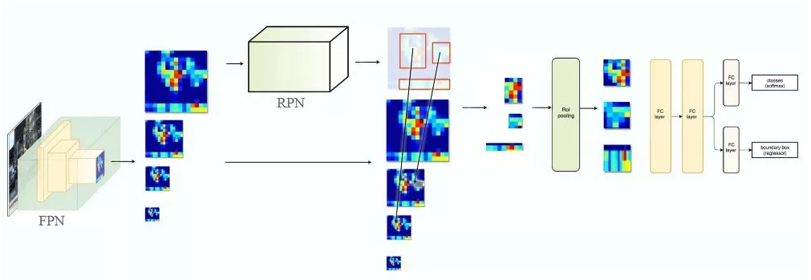

#2D object detection
##Two stage
### R-CNN（Regions with CNN features）CVPR, 2014
+ 前人方案比较
  + SIFT和HOG特征相当于生物的皮质层，不够hierarchical和multi-stage，不够informative
  + 把目标定位简单地当成一个回归问题被证明并不是一个好的方案
  + 用滑动窗口也是可选方案，但在网络加深后，并不能保证足够多的分辨率
+ 贡献点一，Regions(proposed on images) with CNN features
  1. 在原始图片上提出~2k个region proposals
    + selective search
  2. 用仿射变换统一尺寸
    + 候选框周围加上16的padding,再进行各向异性缩放,[参考博客](https://blog.csdn.net/v1_vivian/article/details/80245397)
    + 227 × 227
  3. 利用CNN（共享参数）提取大小统一的特征向量
    + 5 convs + 2 mlps, 4096-dimensional
  4. 最后用SVM进行分类
    + 训练时用hard negative mining策略
    + 测试时，NMS（每个类别是独立进行的），拒绝掉一些和高分区域的IOU大于阈值的候选框
  5. 加入物体框回归可以减少mislocalization几率
    + 提出相对量回归，不直接回归(x,y,w,h),而是如下（loss形式为二范数+正则化）
      + (x*-x)/w, (y*-y)/h, log(w*/w), log(h*/h)
+ 贡献点二，标注数据缺少的情况下，在辅助任务上进行预训练是有效的
  + 基于ILSVRC任务上训练的网络，在PASCAL上进行微调
    + 预训练网络和原始网络在ILSVRC任务上性能差别不大（略差），主要因为训练过程简化
    + 卷积层不变，分类层从1000-way减少到（N+1（background））-way
    + SGD，初始学习率是预训练初始化的十分之一，以确保不会破坏预训练结果
  + 为什么在fine-tunning和SVM训练这两个阶段，定义的正负样例是不同的
    + fine-tunning阶段是由于CNN对小样本容易过拟合，需要大量训练数据，故对IoU限制宽松： IoU>0.5的建议框为正样本，否则为负样本； SVM这种机制是由于其适用于小样本训练，故对样本IoU限制严格：Ground Truth为正样本，与Ground Truth相交IoU＜0.3的建议框为负样本。
  + 为什么单独训练SVM而不用CNN最后一层softmax
    + fine-tunning阶段为了使用更多的样本避免过拟合，放松了IoU条件，但同时导致了object localization性能下降，得用设定更严格的SVM对特征进行分类
+ 实验
  + 卷积特征可视化
    + 选择pool5的一个unit（256-dimensional），可视化激活层输出top16（16 in 256）所对应的原始proposal里的区域
  + 调优 or not，没有调优是指所有的CNN参数就是在ILSVRC2012上训练后的状态
    + 卷积层最有用，虽然只占了百分之6的参数
    + 深度学习方法强于基于统计，随机森林等机器学习方法，如各种DPM特征
  + 通过Hoiem提出的方法，发现localization是本方法错误发生的主要方面
    + 给定pool5的特征，针对每个类，去预测一个偏移量，形成新的检测窗口。[参考博客](https://blog.csdn.net/v1_vivian/article/details/80292569)
    + LoU大于0.6时进行regression，因为回归网络是线性变换，而当前框和真值框足够接近时，真实的变换关系才近似线性
### SPPnet，2014
+ 前人方案缺点
  + R-CNN需要特定尺寸的图像输入
  + R-CNN对每个proposal进行CNN特征提取，同一个图像块被多次传入CNN，有冗余
+ 主要贡献
  + 对整个图像进行CNN feature extract，将图像上的proposal映射到feature map上
    + 这样CNN就只forward了一次，而不是每个proposal都要forward
    + CNN能够感知到整个图像（或者比R-CNN更大的图像范围），而不是像之前的只有局部图像
  + 提出SPP layer，将每个proposal对应的特征图，分别用max pool下采样到4x4，2x2，1x1，然后连接成21-d的向量，这样最后就与输入图像尺寸无关
+ 实验
  + 在不fine-tune的情况下，就达到了SOTA
  + fine-tune时，只对CNN后的三个fc进行，而CNN层保持不变
### Fast R-CNN,2015
+ 前人方案比较
  + SPPnet
    + 三步走，refine，SVM，BBR（bound box regressor）
    + 占空间，CNN特征需要保存到硬盘用于训练SVM和BBR；
    + 原论文中空间金字塔之前的CNN不被fine-tune
    + 但即使fine-tune，由于每个RoI来自不同图片，而且有很大感受野，造成了forward和backward的inefficience
+ 贡献点一
  + 提出RoI（region of interest），由图像上的proposal得到
  + RoI pooling将特征图上的RoI用max pooling下采样到7x7，可以看作spatial pyramid pooling的特例
  + 然后经过一层FC得到RoI feature vector，经过两个FC，分别得到分类结果和regression
+ 贡献点二，多任务损失
  + softmax替代对每个类的二分类SVM，引入了类之间的竞争，交叉熵损失
  + 将RCNN中的二范数改为smooth L1范数（避免梯度爆炸）对K*4个值进行回归，其中K是类别个数
+ 贡献点三，训练
  + 训练时采用hierarchical sampling，在一个mini-batch里同一张图片的RoI共享计算资源
  + LoU大于0.5正例（foreground），[0.1,0.5]（background）,[0,0.1]hard example mining
  + 数据增强：0.5 probability to flip
  + 训练时从训练数据里学习多尺度信息，测试时用图像金字塔得到不同尺度图像
  + 测试时，大的全连接层可以通过截断奇异值分解(SVD)进行压缩来加速
### Faster R-CNN，2016
+ 前人方案缺点
  + R-CNN, SPPnet, Fast R-CNN 都需要借助Selective Search在image上提proposal，耗费了大部分时间
  + 仅仅用GPU进行Selective Search，忽略了下游检测网络，错时了共享计算的机会
+ 贡献点一，提出RPN（region proposal network）
  + FCN，fully convolutionalnetwork
  + 提出anchor的概念，替代之前的RoI
  + 通过对feature map上每个像素引入k个multi-size anchor（每张图片大概WHk个）引入多尺度
    + 纵向比较，有的方法每张图片用k-means得到800个anchor，但在后续网络不共享参数，但本文每个像素的k个anchor分别共享参数
    + 每个像素都提anchor，平移不变性
  + 利用一个slide window（3x3）框取 feature map，拉平成一个向量，然后经过intermediate layer（MLP），得到一个low-dimensional feature
+ 贡献点二
  + 与ground truth交并比最大的anchors作为正例，小于0.3负例，其他的不考虑
    + 正例标准还有与ground truth交并比大于0.7，但这可能导致选不到正例
  + 与基于RoI的方法不同，RoI的size是任意的，因此regressor要适应所有大小，但我们每个像素都提固定的k个anchor，因此只需要训练k个regressor适应不同尺度
    + regressor回归量也变成真值与anchor框的偏移量，且沿用L1 smooth
### FPN（Feature Pyramid Networks），2017
+ 前人方案缺点
  + 由于计算和内存消耗都避免了尺度金字塔表示，但多尺度对提取不同尺度物体，特别是小物体又很重要
+ 多个多尺度方案比较
  + 直接对图像构建尺度金字塔
    + 计算和内存消耗大
    + train时不多尺度，inference时多尺度，造成inconsistency
  + 直接用CNN最后一层，会损失很多信息，因为最后一层分辨率很低
  + 用卷积网络中不同尺度的特征
    + 浅层特征虽然高分辨率，但语义信息较少
    + SSD同时用了不同尺度的特征图，但弃用了一些浅层特征，但这些对小目标检测很重要
+ 贡献，特征金字塔
  + 第一层卷积得到的特征图没有使用，因为语义信息少，且内存消耗大
  + 自下而上的特征高分辨率但语义信息少，自顶而下的粗糙但语义性强
  + 自顶而下简单地利用最近邻上采样
  + 自下而上的特征经过conv 1x1（NIN）卷积降维
  + lateral connection将两种特征merge（相加）
+ 与RPN结合
  + RPN里的3*3 sliding windows和1*1 conv我们把它叫做head
  + 对FPN生成的5个feature map都用上相同的head，不同的feature map anchor的大小不一样（高分辨率对应小anchor）
  + 每个特征图的channel相同，因此可以共用一个分类和回归网络
  + Fast/Faster R-CNN
    + 通过RPN得到一堆原图上的proposals，然后映射到feature map上面，再RoI pooling变化到相同的大小，最后做分类和回归。
    + 在FPN中，feature map有5张图，分布进行上面的步骤
    + 
### Mask R-CNN，2017（arxiv），2020.02（PAMI）
+ 前人方案缺点
  + RoI pooling这一阶段，有quantization误差，这一误差对目标识别可能没太大影响，但对object instance segmentation
+ 贡献点一，RoI align
  + 在RoI的一个bin里采样四个点
  + 怎么采样，采样多少并不是特别重要
  + 根据每个点在特征图里的坐标，用双线性插值得到每个点的特征
  + 对一个bin里的四个点做max或者average
+ 贡献点二，多任务
  + 引入实例分割任务（生成mask）
  + 对RoI预测m*m*K个概率，其中m*m是分辨率，K指K个类
  + 这里与语义分割的多交叉熵损失不同，这里分别对K个类预测mask，没有类间竞争，因为不同
  物体会有遮挡，这对实例分割很重要

##One stage

### YOLO（You Only Look Once）,CVPR 2016
+ 前人方案缺点
  + 需要selective search或者RPN去提proposal，浪费时间，并且训练多余的功能
  + sliding windows和region proposal-based方法都不能直接获得全局视野，因此可以减少背景误识别
+ 主要流程
  + 对每个图像（固定尺寸）划分为SxS的grid
    + 若某个物体的中心位置的坐标落入到某个格子，那么这个格子就负责检测出这个物体
    + 每个格子对应B个bounding box信息，以及C个物体属于某种类别的概率信息。
  + Bounding box信息包含5个数据值，分别是x,y,w,h,和confidence；C个类别概率
    + x,y,w,h分别基于grid cell和image size归一化到0-1
    + confidence等于P（object）*IoU，测试时给具体每个类的confidence score P(class_i|object)*P(class_i|object)*P(object)*IoU
  + 输出SxSx(5B+C)个结果
  + Loss设计
    + 包围框损失、confidence损失（IOU*P(object)）和分类损失
    + 因为有很多背景导致confidence为0，变相放大了有物体的confidence误差，因此给confidence误差较小系数0.5
    + 希望更关注小包围框的误差，所以w和h取的是平方根（不能根本解决）
+ 训练
  + 为防止发散，lr 0.001，0.01,0.001,0.0001
  + imagenet 分类预训练用224*224，目标检测时用448*目标检测时用448
  + 每个cell预测多个边界框，但是其对应类别只有一个。如果cell确实有object，只选择与ground truth的IOU最大的那个边界框来负责预测该目标，而其它边界框认为不存在目标。这样设置的一个结果将会使一个单元格对应的边界框更加专业化。
+ 限制
  + 依赖于物体识别标注数据，因此，对于非常规的物体形状或比例，YOLO的检测效果并不理想。
  + 采用了多个下采样层，网络学到的物体特征并不精细
  + 对于小物体，小的IOU误差也会对网络优化过程造成很大的影响，从而降低了物体检测的定位准确性
### SSD（Single Shot Detector），ECCV 2016
+ 前人方案缺点
  + 生成proposal和后续的resample（pool）耗费时间
+ 贡献点
  + 在truncated base network后面加了几层卷积，分别对每层卷积进行BB提取
  + 对于其中一层，用一个3x3xB的卷积核（而不是MLP），得到B个检测框，以及他们各自对应的类别概率和大小
+ 训练
  + 输入图像尺寸固定，输出的default boxes也固定
  + 为ground truth挑选对应的boxes，jaccard overlap（IoU） 大于0.5的所有default box
  + localization loss和faster R-CNN一样，confidence loss里真值为[0,1]，和YOLO定义为IoU不同
  + 根据每个特征图的scale不同，按照固定的比例，选取default boxes
  + 按照confidence loss进行排序，筛选负例，使得负例和正例比为3:1
  + 输入整张图片；对真实图片进行采样，使得最小IoU为0.1, 0.3, 0.5, 0.7, or 0.9；随机采样
### Focal Loss，ICCV 2017
+ 前人不足
  + 单阶段不如两阶段是因为类别不均衡导致的，两阶段有RPN和sample可以让正负样本保持一定比例
  + 启发式抽样和难例发掘不高效，因为负样本太多了
  + OHEM用loss最高的组成minibatch，这样虽然增加了错分类样本的权重，但是OHEM算法忽略了容易分类的样本
+ 贡献一，focus loss
  + 既可以控制正样本和负样本的loss权重，也可以控制难分类和易分类之间的
  + γ是调制系数（modulating factor），减少易分类样本的权重，从而使得模型在训练时更专注于难分类的样本
  + 当一个样本被分错的时候，pt是很小的，（1-Pt）接近1，损失不被影响；当Pt→1，因子（1-Pt）接近0，权值就被调低了
+ 贡献二，RetinaNet
  + Resnet+FPN作为backbone，cls和reg两路subnet分别加在各个Pyramid level上
  + 在每层特征图上加A（9）个anchor
  + 与RPN对比，该网络的object classification子网络更深，只用 3*3 卷积，且不和box regression子网络共享参数
  + 用了一个class-agnostic（与类别无关） bounding box regressor
  + Object classification和bounding box regression两个网络共享一个网络结构，但是分别用不同的参数
