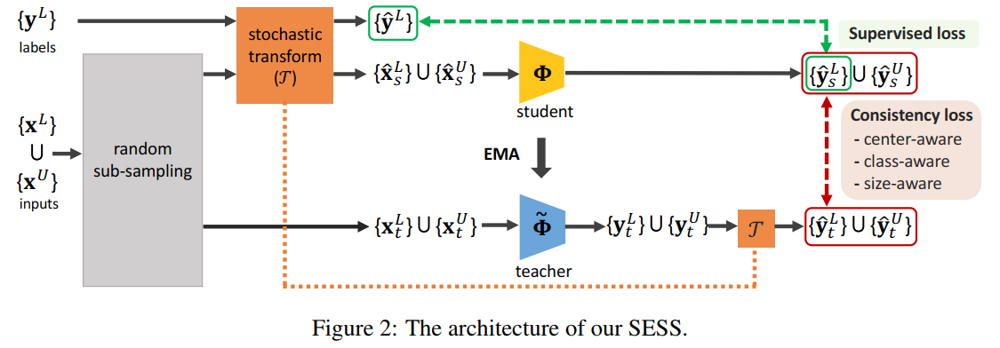
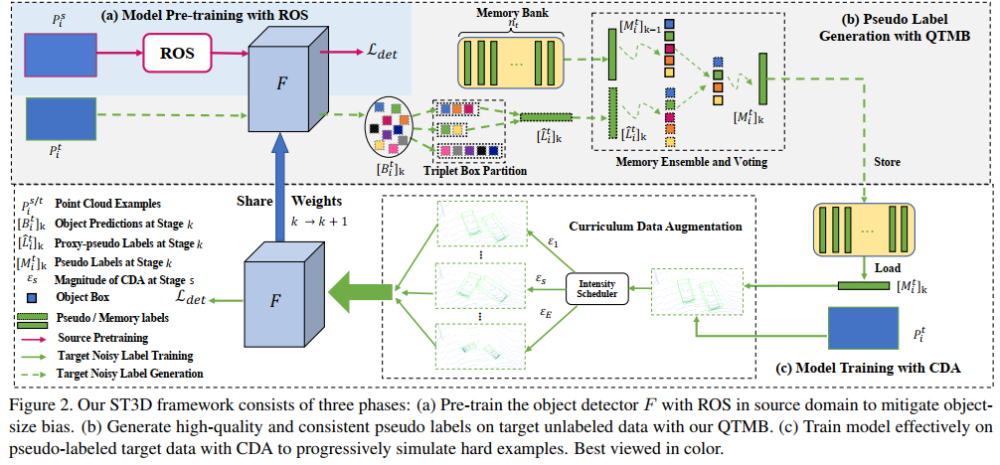
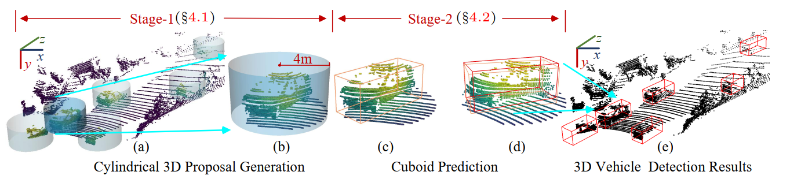

### Transferable semisupervised 3d object detection from rgb-d data（ICCV 2019）
+ 第一篇半监督3d检测
+ 需要2D标注框和部分3D标注框
### SESS（Self-Ensembling Semi-Supervised）（CVPR2020）
+ 第一篇只需要3D数据的半监督3d detection
+ 主要贡献点，perturbation scheme和consistency loss
  + 
+ perturbation scheme
  + 学生网络扰动加载输入，教师网络扰动加在输出
  + 图像识别扰动：随机平移，水平翻转，在输入层加高斯噪声，dropout。
  + 点云：随机降采样，保持全局几何结构一致（局部相差可能很大）；随机变换：xyflip，rotation，scale
+ consistency loss
  + 仿照CD loss提出了center-aware consistency loss
  + 用KL散度表示class-aware consistency loss,希望student的熵越来越小（因为是KL(S||T)）
  + 用二范数表示size-aware consistency loss
+ 思考
  + 可否通过配准帮助center进行关联
  + 没有考虑教师网络可能学错的可能
### 3DIoUMatch（CVPR2021）
+ 第一篇KITTI上做了实验的半监督3d检测
+ 用的是mean teacher架构
+ 仿照fixmatch提出了一个LHS， only discards half of the proposals with lower predicted IoU，阈值是 class-aware self-adjusted filtering
  + 生成的伪标签不能覆盖真值，所以只对伪标签附近的BBoX进行优化
+ 能不能用无监督方法的损失+pseudo-label的损失
### 3D auto label，cvpr 2021
+ motivation
  + offboard时，可以处理更长的时间序列点云，以获得高质量的“auto label”
  + 输入多个点云帧会提升检测的效果，但是之前的“frame-centric”方法随着帧增多，收益也变小
+ related work
  + 常用多帧算法（多帧可以形成更加致密的点云或对点云进行补全）
    + 多帧特征图连接
    + 把不同帧点云配准到一个帧上
    + 基于图进行时空上的聚合
    + LSTM
  + 列举了一些图像和点云结合的多模态算法
  + 学习点云序列
    + 简单的场景流任务
    + MeteorNet证明了更长的序列会具有更好的性能
  + auto label
    + 图像pseudo-label
    + 点云一些auto label方法
+ 任务描述：给定多帧点云和每帧位姿，输出每帧的目标检测结果
+ 两个处理序列的baseline
  + 直接累积多帧点云，但因为多帧内存在动态物体，不能对物体运动进行补偿
  + 在Two-stage方法的第二阶段输入多帧的物体点云。不能决定输入多少帧，一旦固定n帧，对某些物体是好的，但对其他一些物体可能是次优的
+ 贡献一，提出object-centric
  + 把每个物体编码成4D信息，多出的1D代表时序信息
+ 贡献点二，Multi-frame MVF++ and Multi-object Tracking
  + MVF++，在原有MVF的基础上加上语义分割（是否属于物体），anchor-free，重新设计网络结构
  + Multi-frame MVF++，将点都变换到世界坐标系，每个点扩展一个channel，编码相对时空offset
  + 利用卡尔曼滤波跟踪，并且物体点云和BBoX变换到世界坐标系
+ 贡献点三，Multi-object Tracking
  + 根据跟踪信息对动静进行判断
  + 迭代式地回归静态物体的BBoX
  + 动态物体则是结合点云的时序编码和跟踪的BBoX的时序编码回归中间序列的BBoX
### ST3D (CVPR 2021)

+ 提出的是个self-training框架
1. ROS, random object scaling
  + 在局部坐标系上进行scale random
2. QTMB, pseudo label generation, we develop a quality-aware triplet memory bank
  + 我们是第一个证明IoU可以作为一个很好的标准来评估伪标签的质量
3. triplet box partition scheme
  + 依照IoU进行State分类
4. memory bank
  + 根据置信度对memory里的标签进行更新
5. CDA, curriculum data augmentation
  + 逐渐得增大数据增强的强度
### Weakly Supervised 3D Object Detection from Lidar Point Cloud

+ 用在BEV上点的中心点弱监督3d detection
### 思考
+ 能不能用无监督方法的损失+pseudo-label的损失
+ 能不能解决长尾效应
