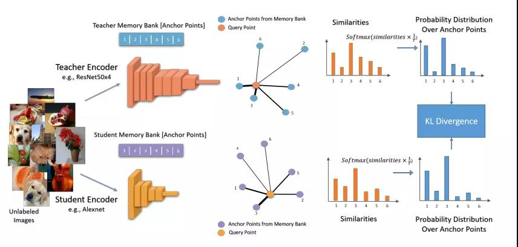

### CompRess: Self-Supervised Learning by Compressing Representations
+ 我们需要通过计算输入图像（query）和所有已知数据点（anchor）之间的距离得到一个教师网络空间中的最近邻分类器，然后将这些距离转化为概率分布
+ 将这种教师空间中的概率分布迁移到学生网络中，从而使学生网络与教师网络中 anchor 的排序相匹配
+ 

### SE-SSD（Self-Ensembling），cvpr 2021
+ motivation
+ hard 目标的样本点云和特征可能差异很大（即尽管是标注的样本，由于距离和遮挡等因素，同一目标的差异可能很大，因此需要 soft 样本）。相比之下，每个训练样本的soft 目标信息更丰富，有助于揭示同类的数据样本之间的差异。这促使我们将相对精确的teacher predication视为soft 目标，并利用它们来共同优化具有 hard 目标的student
+ hard 目标：即标注信息
+ soft 目标：由teacher SSD模型预测的相对精确的目标
+ 贡献点
+ 用知识蒸馏的方法辅助训练，但在inference时不会增加计算量
+ teacher输出的soft target经过IoU consistent之后给student训练，此时的soft target相比于hard具有更多的信息，更高的熵
  + 使用student SSD参数通过标准指数移动平均(EMA)更新teacher SSD
  + teacher SSD可以从student SSD那里获得蒸馏知识，并产生 soft 目标来监督student SSD。因此，最终训练的student SSD称为Self-Ensembling single-stage 目标检测
+ hard target经过数据增强后也给student训练，但是因为点云稀疏不好回归，更偏向于中心点回归和角度回归
  + 数据增强是把物体分为6个面，随机删除，随机交换一个面，最后稀疏化
  + 中心点损失用(中心点差/最小框对角线)^2
  + 角度：(1-cos(delta r)) + 正反分类
