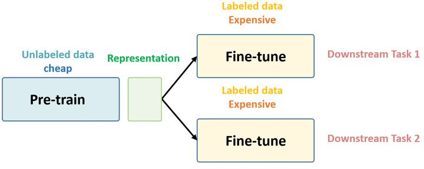
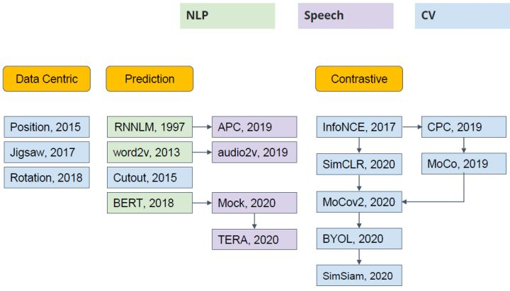
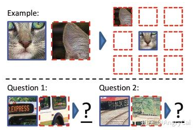
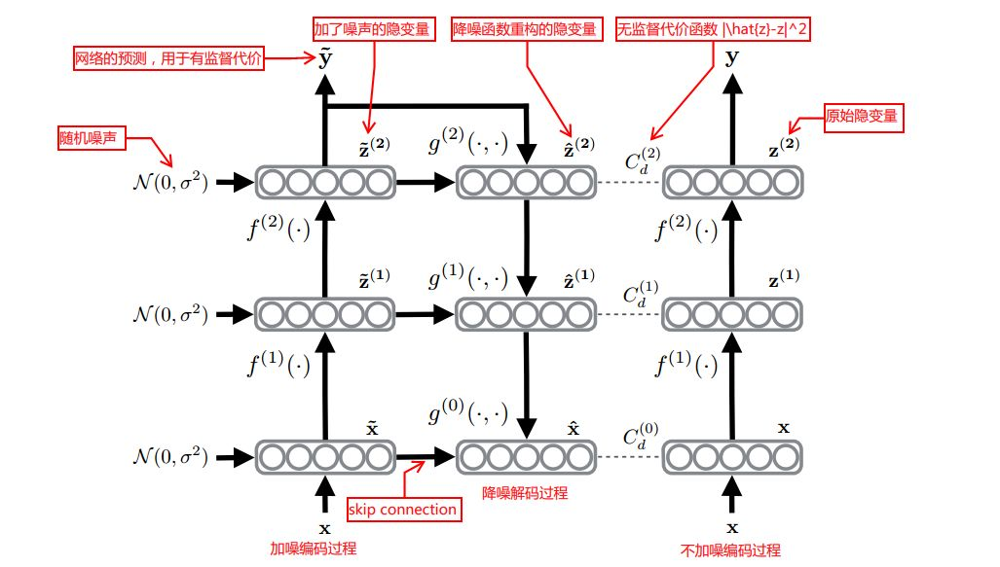
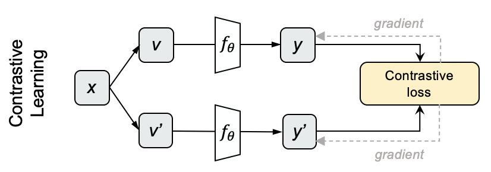
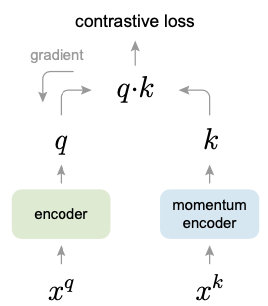
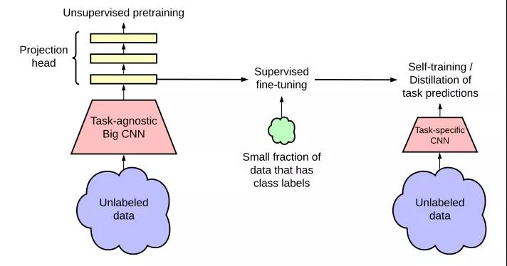
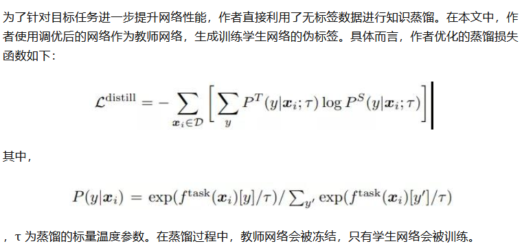
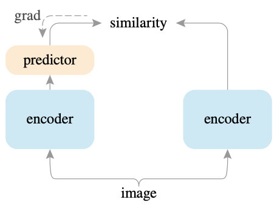

## self-supervised
+ 核心思想：先无监督训练，然后再有监督微调
  1. Unsupervised Pre-train in a task-agnostic way.
  2. Supervised Fine-tune in a task-specific way.
  + 
+ 经典工作分类
  + 
  + 注：Prediction：像做填空题，给一个句子随机盖住 (mask掉) 一个token，预测盖住的部分
+ 主要有pretext task和contrast两种方案
### pretext task（代理任务/前置任务）
+ Generative
  + auto-encoder
  + 图像着色
  + 图像补全
+ 预测图像旋转
+ 图像变形
+ Context Prediction，相对位置预测&拼图问题
  + 
#### Ladder Network
+ 无监督预训练一般是用重构样本进行训练，其编码（学习特征）的目的是尽可能地保留样本的信息
+ 而有监督学习是用于分类，希望只保留与任务相关的、具有内在不变性的特征，去除不必要的特征
+ 无监督学习和有监督学习的目的不一致, 通过 skip connection 解决这个问题
+ 
### 对比学习
+ InfoNCE(2017,DeepMind)
  + 
  + 通过计算样本表示间的距离，拉近正样本，拉远负样本
  + 
+ MoCo（CVPR20）
  + 负例越多，这个任务就越难 → 增加负例
  + 纯粹的增大batch size → memory bank
  + momentum的方式更新encoder参数，解决新旧候选样本编码不一致
    + 
+ SimCLR（ICML20）
  + 
  + 探究了不同的数据增强组合方式，选取了最优的
  + 在encoder之后增加了一个非线性映射g
    + 研究发现encoder会保留和数据增强变换相关的信息，而非线性层的作用就是去掉这些信息
    + 注意非线性层只在无监督训练时用，在迁移到其他任务时不使用
+ MoCo v2
  + 改进了数据增强方法
  + 训练时在encoder的表示上增加了相同的非线性层
  + 为了对比，学习率采用SimCLR的cosine衰减
  + 
+ SimCLR v2
  + 
  + 借鉴memory bank,将之前的负例缓存起来，从而扩大负例的数量
  + 无监督预训练表征+监督式调优
    + 数据标签越少时，使用越大的网络模型就越有利于提升通过任务无关的方式利用无标签数据进行训练的效果
      + 探索了更大的 ResNet 模型(更深但维度略小)
      + 增大了非线性网络（投影头）g(·)的容量
      + 随着 SimCLR v2 网络深度、宽度的增加，模型的 Top-1 准确率递增
  + 知识蒸馏，将大型的自监督模型学习到的数据表征用于提升基于小样本的半监督学习任务,并将知识迁移到小模型的学生网络上
    + 
+ SwAV
  + 对各类样本进行聚类，然后去区分每类的类簇
  + 一种新的数据增强方法，将不同分辨率的view进行mix
+ BYOL
  + 
  + 将表示预测问题转换为了正负例判别问题，这样就迫使模型的输出是多样的，避免坍缩
+ SimSiam
  + 
  1. 左侧的编码器生成z1，经过MLP后输出p1
  2. 右侧的编码器生成z2
  3. 计算p1与z2的cosine相似度
  4. 左右调换，再计算p2与z1的cosine相似度
  5. 最大化3、4两个步骤的和，且右侧永远不传播梯度
+ Rethinking imagenet pre-training
  + ImageNet 预训练对于 COCO 数据集上的目标检测任务的提升有限——何恺明
+ Rethinking Pre-training and Self-training
  + 强大的数据增强和更多的标签数据会降低预训练的价值
    + 如果用足够多的COCO数据集，那ImageNet上的预训练益处就会减少
  + 在预训练有效的情况下，自训练对性能的提升更大
  + 使用高强度数据增强时，自监督预训练也会降低模型的性能
### 两种方案对比
+ pretext task在无监督阶段，没有构建有效的负例制约自监督学习
+ 
+ Self-supervised Learning: Generative or Contrastive，唐杰
