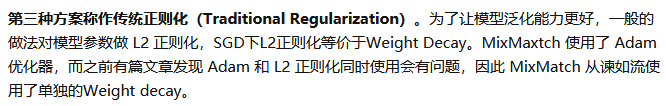
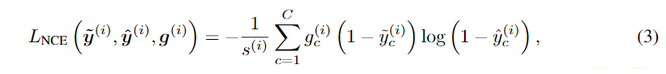

# 半监督
+ 定义来源：Introduction to Semi-supervised Learning
+ 三个基本假设
  + Smoothness Assumption
    + 如果两个样本 x1，x2 相似，则它们的相应输出 y1，y2 也应如此
  + The Cluster Assumption
    + 聚类假设也可以被视为低密度分离假设，即：给定的决策边界位于低密度地区
  + The Manifold Assumption
    + （a）输入空间由多个低维流形组成，所有数据点均位于其上；（b）位于同一流形上的数据点具有相同标签。
+ 需要解决的问题
  + 无标签数据与有标签的数据数目不均衡
  + 无标签数据与有标签的数据类别分布不一致
  + 如果用Proxy(Pseudo)-label，有一定几率会出现错误
+ 主要分为Consistency Regularization，Proxy(Pseudo)-label Methods，Holistic Methods三类

## 基础框架介绍
### Consistency Regularization
+ Consistency Regularization
  + 利用未标记的数据来强化训练模型，使其符合聚类假设，即学习的决策边界必须位于低密度区域
  + 对于无标签图像，添加噪声之后模型预测也应该保持不变。
  + 关键方法，self-ensembling
    + 模型预测结果的融合
    + 模型参数的融合
    + 引入滑动平均来平衡各个阶段的结果
#### Ladder Network(auto-encoder)
+ Semi-Supervised Learning with Ladder Networks
+ 无监督预训练一般是用重构样本进行训练，其编码（学习特征）的目的是尽可能地保留样本的信息
+ 而有监督学习是用于分类，希望只保留与任务相关的、具有内在不变性的特征，去除不必要的特征
+ 无监督学习和有监督学习的目的不一致, 通过 skip connection 解决这个问题
+ 

#### Pi-Model
+ motivation
  + 由于正则化技术（例如 data augment 和 dropout）通常不会改变模型输出的概率分布
  + 对于任何给定的输入 x，使用不同的正则化然后预测两次，而目标是减小两次预测之间的距离（MSE），提升模型在不同扰动下的一致性
+ 
+  需要进行两次前向推理，包含一次随机增强变换和不做增强的前向运算
  + 第一项含有一个时变系数 w。x 是未标记数据，由两次前向运算结果的均方误差（MSE）构成
  + 第二项由交叉熵构成，x 是标记数据，y 是对应标签
  + 

#### Temporal Ensembling
  + 在目标函数的无监督一项中， Pi-Model 是两次前向计算结果的均方差，而在temporal ensembling 模型中，使用时序组合模型，采用的是当前模型预测结果与历史预测结果的平均值做均方差计算
    + 有效地保留历史了信息，消除了扰动并稳定了当前值
    + 不用每次都两次前向传播了
  + 

#### Mean teachers
+ 
+ Temporal Ensembling 对模型的预测值进行 EMA（exponential moving averag），而Mean Teachers 采用了对 studenet 模型权重进行 EMA

#### Unsupervised Data Augmentation（UDA）
+ motivation
  + 发现输入 x 增加的噪声 α 对模型的性能提升有着重要的影响，相比于之前的简单随机噪声，改进了增强方式
+ 
+ 不同的任务其数据扩增应该要不一样

### Proxy(Pseudo)-label Methods
#### self-training
+ 大概流程
  + 
+ 生成伪标签的两种方式，锐化方法和 Argmax 方法
  + 许多半监督学习方法都基于一个共识，即分类器的分类边界不应该穿过边际分布的高密度区域。具体做法就是强迫分类器对未标记数据作出低熵预测
  + 
+ 存在问题
  + 过拟合，可能一直在强化标签数据
  + 可能生成错误的pseudo label,从而放大偏差

#### Pseudo-Label, ICML 2013
+ 两个原理
  + Low-Density Separation between Classes
    + 每个类的决定界互相离得很远，有利于提升泛化性能
      + 前人做法一：通过嵌入的惩罚项，使得高密度的区域具有相同的标签
      + 前人做法二：鼓励网络输出对向低密度的区域的变化不敏感
  + Entropy Regularization
    + 熵与类间重合率有一定联系：熵越大，代表类间重合率越高，特征空间类分布密度也高了
      + 无标签数据的熵：$H\left(y \mid x^{\prime}\right)=-\frac{1}{n^{\prime}} \sum_{m=1}^{n^{\prime}} \sum_{i=1}^{C} P\left(y_{i}^{m}=1 \mid x^{\prime m}\right) \log P\left(y_{i}^{m}=1 \mid x^{\prime m}\right)$
    + 因此目标变为最大化有标签数据的似然概率，最小化无标签数据的熵
      + 最大似然分布定义为：$C(\theta, \lambda)=\sum_{m=1}^{n} \log P\left(y^{m} \mid x^{m} ; \theta\right)-\lambda H\left(y \mid x^{\prime} ; \theta\right)$
+ 对应具体分类任务
  + 将拥有最大预测概率的类给定无标签数据
    + $y_{i}^{\prime}=\left\{\begin{array}{ll}1 & \text { if } i=\operatorname{argmax}_{i^{\prime}} f_{i^{\prime}}(x) \\ 0 & \text { otherwise }\end{array}\right.$
  + 无标签数据和有标签数据用同样的损失，并设定一个用模拟退火算法确定的平衡系数
    + $L=\frac{1}{n} \sum_{m=1}^{n} \sum_{i=1}^{C} L\left(y_{i}^{m}, f_{i}^{m}\right)+\alpha(t) \frac{1}{n^{\prime}} \sum_{m=1}^{n^{\prime}} \sum_{i=1}^{C} L\left(y_{i}^{\prime m}, f_{i}^{\prime m}\right)$
    + $\alpha(t)=\left\{\begin{array}{ll}0 & t<T_{1} \\ \frac{t-T_{1}}{T_{2}-T_{1}} \alpha_{f} & T_{1} \leq t<T_{2} \\ \alpha_{f} & T_{2} \leq t\end{array}\right.$

#### co-training
+ 大概流程
  + 有 m1 和 m2 两个模型，它们分别在不同的数据集上训练
  + 每轮迭代中,会相互生成标签
  + 

#### Tri-Training
+ 首先对有标记示例集进行可重复取样（bootstrap sampling）以获得三个有标记训练集
+ 从每个训练集产生一个分类器
+ 其余两个对一个unlabel预测相同，则把它加入到第三个的训练集
+ 

### Holistic Methods（Consistency-based SelfTraining）
#### MixMatch[NeurIPS 2019][超强半监督学习 MixMatch](https://zhuanlan.zhihu.com/p/66281890)
+ 
+ 自洽正则化（Consistency Regularization）,数据增广
+ 最小化熵（Entropy Minimization），sharpen
+ 传统正则化
+ 
+ 
  + L2 Loss 比 Cross Entropy Loss 更加严格。原因是 Cross Entropy 计算是需要先使用 Softmax 函数，而 softmax 函数对于常数叠加不敏感
+ 优于GAN做半监督学习，差于Unsupervised Data Augmentation
#### ReMixMatch（ICLR 2020）
+ 
+ Distribution Alignment。由于MixMatch的标签猜测可能存在噪声和不一致的情况，作者提出利用有标签数据的标签分布，对无标签猜测进行对齐。$q=p_{\text {model }}(y \mid u ; \theta)$ 是对当前无标签数据的标签猜测，$\tilde{p}(y)$ 是一个运行平均版本（running average）的无标签猜测，$p(y)$ 是有标签数据的标签分布。对齐之后的标签猜测如下：
  + $\tilde{q}=$ Normalize $\left(q \times \frac{p(y)}{\tilde{p}(y)}\right)$
+ Augmentation Anchor。作者的假设是对样本进行简单增强（比如翻转和裁切）之后的预测结果，要比多次复杂变换更加可靠和稳定。因此，对于同一张图片，首先进行弱增强，得到预测结果 $\tilde{q}$，然后对同一张图片进行复杂的强增强。弱增强和强增强共同使用一个标签猜测 $\tilde{q}$, 进行Mixup和模型训练。
#### FixMatch（NIPS 2020）
+ motivation
  + 演示了两种常见SSL方法的简单组合的力量：一致性正则化和伪标记
+ FixMatch 是对弱增强图像与强增强图像之间的进行一致性正则化，但是其没有使用两种图像的概率分布一致，而是使用弱增强的数据制作了伪标签，
  + 弱增强：用标准的翻转和平移策略
  + 强增强：输出严重失真的输入图像，先使用 RandAugment 或 CTAugment，再使用 CutOut 增强
+ 
+ 

#### FeatMatch（ECCV 2020）

#### Noisy student（CVPR 2020）
+ 使用不同的方法给学生增加噪音。但当生成伪标签时，教师并没有被噪声干扰
+ 尽管教师和学生的结构可以相同，但学生模型的容量应该更高，因为同时拟合label和unlabel
+ 平衡数据：作者发现，当每个类的未标记图像数量相同时，学生模型效果良好

#### UPS(Uncertainty-Aware Pseudo-Label Selection)(ICLR 2021)
+ motivation
  + 一致性正则法占据主导，最常用的是基于数据增强，但需要搜索最合适的（domain-specific）增强方法。但像视频分类就没有有效的增强策略，半监督泛化性就不好了。
    + 
  + Pseudo-label如果出错，则引入noisy label。仅凭网络softmax层输出的概率值作为置信度唯一的依据显然不够
    + 参考深度网络不确定性估计的技术(MC-dropout, ICML 2016)，计算输出不确定性作为另一种置信度，筛选可靠pseudo-label
+ Negative Learning / negative cross-entropy loss
  + 
  + 
+ 结合不确定性挑选pseudo positive和negative label
  + 
  + 
  + 重新随机初始化，是为了避免打上错误伪标签的样本带来的误差在迭代训练中不断传播

####  CReST(CVPR, 2021)
+ motivation,半监督场景下的长尾分布问题
  + 长尾分布常用策略，重采样 (Re-Sampling) 以及重加权 (Re-Weighting)
    + 
    + 欠采样减少头部类别的样本数,过采样对尾部类别进行重复采样增加其样本数。（可能造成对尾部类别过拟合以及对头部类别欠拟合）
    + 重加权方法的核心思想是类别少的样本应该赋予更大的权重，类别多赋予更少权重
  + 
    + 实验现象表明，模型对头部类别的样本 Recall 很高，对尾部类别的 Recall 很低；模型对头部类别样本的 Precision 很低，但对尾部类别的 Precision 却很高。
+ 贡献
  + 
  + 使用标准的 SSL 算法（fixmatch）利用已标记集和未标记集的信息训练一个有效的模型
  + 给未标记集中的每个样本打上伪标记得到新的数据集
  + 挑选出模型的预测类别属于尾部类别的样本作为候选集加入到已标记集合中
    + 尾部类别具有High precision，可以当做ground truth
    + 引入了尾部类别样本，从而缓解了类别不平衡问题
+ 可能存在问题
  + 被挑选出来的样本虽然有很大的可能具有正确的伪标记，但它可能不太具备代表性（简单样本），loss其实很小，对模型的影响也不大
  + 提升可能绝大部分来自于类别平衡了

### 参考文献：
1. [超强半监督学习 MixMatch](https://zhuanlan.zhihu.com/p/66281890)
2. [长文总结半监督学习](https://zhuanlan.zhihu.com/p/252343352)
3. [综述：自监督学习与知识蒸馏的碰撞](https://zhuanlan.zhihu.com/p/313372516)
